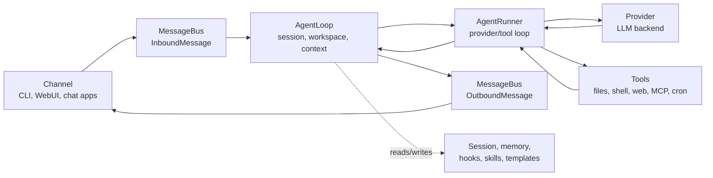
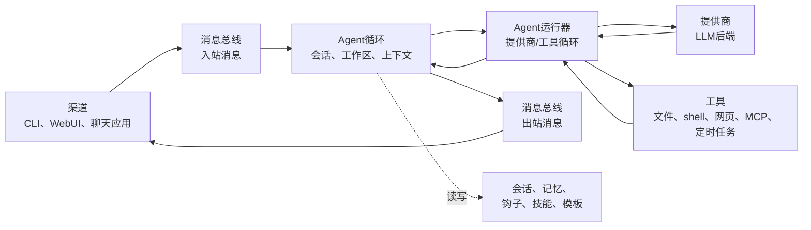

# Architecture

This page maps nanobot's runtime behavior to source files. Use it when you are debugging internals, reviewing a PR, adding a provider/channel/tool, or trying to understand where a user-visible behavior comes from.

For the product-level mental model, read [`concepts.md`](./concepts.md) first.

## Core Flow



Main files:

| Area | Files |
|---|---|
| Message events and queue | `nanobot/bus/events.py`, `nanobot/bus/queue.py` |
| Turn orchestration | `nanobot/agent/loop.py` |
| Provider/tool conversation loop | `nanobot/agent/runner.py` |
| Context construction | `nanobot/agent/context.py` |
| Session storage and compaction | `nanobot/session/manager.py` |
| Long-term memory and Dream | `nanobot/agent/memory.py` |

## Agent Loop vs Agent Runner

`AgentLoop` owns the channel-facing turn:

- receives inbound messages;
- determines the effective session and workspace scope;
- builds context;
- wires hooks, progress, and channel metadata;
- publishes outbound messages.

`AgentRunner` owns the model-facing loop:

- sends messages to the selected provider;
- handles streaming deltas and reasoning blocks;
- executes tool calls;
- feeds tool results back into the model;
- stops when a final answer is produced or runtime limits are hit.

Keep this split in mind when debugging. If a problem is about channel routing, session keys, workspace selection, or outbound delivery, start in `agent/loop.py`. If it is about provider calls, tool calls, streaming, or iteration limits, start in `agent/runner.py`.

## Providers

Provider metadata is centralized in `nanobot/providers/registry.py`. Configuration fields live in `nanobot/config/schema.py`.

Provider selection uses:

- explicit `agents.defaults.provider` or preset provider;
- provider registry keywords;
- API key prefixes and API base URL hints;
- local provider fallback when `apiBase` is configured;
- gateway fallback for providers that can route many model families.

Provider implementations live in `nanobot/providers/`. Most hosted providers use the OpenAI-compatible implementation, while Anthropic, Azure OpenAI, AWS Bedrock, OpenAI Codex, and GitHub Copilot have specialized paths.

Useful docs:

- [`providers.md`](./providers.md) for practical setup;
- [`configuration.md#providers`](./configuration.md#providers) for exact provider reference.

## Channels

Channels translate external platforms into `InboundMessage` events and send `OutboundMessage` events back to the platform.

Main files:

| Area | Files |
|---|---|
| Base channel contract | `nanobot/channels/base.py` |
| Built-in channels | `nanobot/channels/*.py` |
| Discovery and lifecycle | `nanobot/channels/manager.py` |
| WebSocket/WebUI channel | `nanobot/channels/websocket.py` |

Channels are discovered through built-in module scanning and plugin entry points. A custom channel should follow [`channel-plugin-guide.md`](./channel-plugin-guide.md).

## WebUI and Gateway

`nanobot gateway` starts:

- enabled chat channels;
- the WebSocket channel when configured;
- workspace-scoped cron service;
- system jobs such as Dream and heartbeat;
- the health endpoint on `gateway.port`.

The packaged WebUI is served by the WebSocket channel, not the health endpoint:

| Surface | Default |
|---|---|
| Health endpoint | `http://127.0.0.1:18790/health` |
| WebUI/WebSocket | `http://127.0.0.1:8765` |

WebUI source lives in `webui/`. The production build is written to `nanobot/web/dist/` and bundled into the wheel.

Useful docs:

- [`webui.md`](./webui.md) for the WebUI user guide;
- [`../webui/README.md`](../webui/README.md) for frontend source development;
- [`websocket.md`](./websocket.md) for protocol details.

## Tools

Tools are discovered from `nanobot/agent/tools/` and plugin entry points.

Important files:

| Tool area | Files |
|---|---|
| Tool base and schema | `nanobot/agent/tools/base.py`, `nanobot/agent/tools/schema.py` |
| Discovery | `nanobot/agent/tools/registry.py` |
| Shell execution | `nanobot/agent/tools/shell.py` |
| Filesystem tools | `nanobot/agent/tools/filesystem.py` |
| Web search/fetch | `nanobot/agent/tools/web.py` |
| MCP tools | `nanobot/agent/tools/mcp.py` |
| Cron | `nanobot/agent/tools/cron.py`, `nanobot/cron/` |
| Image generation | `nanobot/agent/tools/image_generation.py` |
| Runtime self-inspection | `nanobot/agent/tools/self.py` |

Tool behavior is part of the model contract. Keep user-visible tool names, schemas, and error messages stable unless a change is intentional.

## Config and Paths

The config schema lives in `nanobot/config/schema.py`. Loading and saving live in `nanobot/config/loader.py`. Runtime path helpers live in `nanobot/config/paths.py`.

Defaults:

| Path | Default |
|---|---|
| Config | `~/.nanobot/config.json` |
| Workspace | `~/.nanobot/workspace/` |
| Sessions | `<workspace>/sessions/*.jsonl` |
| Memory | `<workspace>/memory/` |
| Cron store | `<workspace>/cron/jobs.json` |
| WebUI/media/log runtime data | config directory subdirectories such as `webui/`, `media/`, and `logs/` |

The schema accepts both camelCase and snake_case keys, but saves config with camelCase aliases.

## Memory and Sessions

Session history is the near-term conversation replay. Memory is the longer-term workspace state.

| Store | File area |
|---|---|
| Session JSONL files | `<workspace>/sessions/` |
| Long-term memory | `<workspace>/memory/MEMORY.md` |
| Consolidation source history | `<workspace>/memory/history.jsonl` |
| Bootstrap identity files | `<workspace>/SOUL.md`, `<workspace>/USER.md`, templates under `nanobot/templates/` |

Dream is implemented in `nanobot/agent/memory.py` and scheduled by the runtime when enabled.

## Security Boundaries

Security-sensitive code paths include:

| Boundary | Files |
|---|---|
| Workspace scope | `nanobot/security/workspace_access.py`, `nanobot/security/workspace_policy.py` |
| Shell sandboxing | `nanobot/agent/tools/shell.py` |
| SSRF/network checks | `nanobot/security/network.py`, `nanobot/agent/tools/web.py` |
| PTH guard and CLI startup security | `nanobot/security/` and CLI entrypoints |
| Channel access control | channel config in `nanobot/channels/*.py` |

When changing tools, channels, file access, WebUI workspace behavior, or network fetching, treat security as part of the functional behavior and update docs if the user-facing boundary changes.

## Extension Points

| Extension | How |
|---|---|
| Provider | Add `ProviderSpec` in `providers/registry.py`, add schema field in `config/schema.py`, implement provider only if the generic backend is not enough |
| Channel | Implement `BaseChannel`, expose an entry point, follow [`channel-plugin-guide.md`](./channel-plugin-guide.md) |
| Tool | Implement a tool under `agent/tools/` or expose a plugin entry point |
| MCP | Add `tools.mcpServers` config |
| Skill | Add workspace skill files under `<workspace>/skills/` or built-in skills under `nanobot/skills/` |

Prefer existing registry/discovery patterns over ad hoc wiring.

## Testing and Verification

Common checks:

```bash
pytest tests/test_openai_api.py::test_function -v
ruff check nanobot/
cd webui && bun run test
cd webui && bun run build
```

Choose tests based on the changed surface:

| Change | Minimum useful verification |
|---|---|
| Provider behavior | Provider unit tests or a mocked API path; `nanobot agent -m "Hello!"` with safe config when possible |
| Channel behavior | Channel tests plus `nanobot gateway` startup path |
| WebUI behavior | WebUI tests/build and, for routing/settings/chat changes, browser-level verification through the gateway |
| Tool behavior | Tool unit tests and an agent-run path when schema or model-facing behavior changes |
| Docs | Link checks, command accuracy against CLI/schema, and `git diff --check` |

For user-facing flows, prefer at least one verification path through the public surface the user actually touches: CLI command, HTTP endpoint, WebSocket/WebUI, chat channel, or packaged import.

# 架构

本页面将 nanobot 的运行时行为映射到源码文件。当你调试内部机制、审阅 PR、添加提供商/渠道/工具，或试图理解某个用户可见行为的来源时，请使用此页面。

产品层面的心智模型，请先阅读 [`concepts.md`](./concepts.md)。

## 核心流程



主要文件：

| 区域 | 文件 |
|---|---|
| 消息事件和队列 | `nanobot/bus/events.py`、`nanobot/bus/queue.py` |
| 交互轮次编排 | `nanobot/agent/loop.py` |
| 提供商/工具对话循环 | `nanobot/agent/runner.py` |
| 上下文构建 | `nanobot/agent/context.py` |
| 会话存储和压缩 | `nanobot/session/manager.py` |
| 长期记忆和 Dream | `nanobot/agent/memory.py` |

## Agent 循环 vs Agent 运行器

`AgentLoop` 负责面向渠道的交互轮次：

- 接收入站消息；
- 确定有效的会话和工作区范围；
- 构建上下文；
- 连接钩子、进度通知和渠道元数据；
- 发布出站消息。

`AgentRunner` 负责面向模型的循环：

- 向选定的提供商发送消息；
- 处理流式增量和推理块；
- 执行工具调用；
- 将工具结果反馈给模型；
- 在产生最终答案或达到运行时限制时停止。

调试时请记住这个分工。如果问题涉及渠道路由、会话键、工作区选择或出站投递，从 `agent/loop.py` 开始。如果问题涉及提供商调用、工具调用、流式输出或迭代限制，从 `agent/runner.py` 开始。

## 提供商

提供商元数据集中在 `nanobot/providers/registry.py`。配置字段位于 `nanobot/config/schema.py`。

提供商选择使用：

- 显式的 `agents.defaults.provider` 或预设中的提供商；
- 提供商注册表关键字；
- API 密钥前缀和 API 基础 URL 提示；
- 配置了 `apiBase` 时的本地提供商回退；
- 可路由多种模型系列的网关回退。

提供商实现位于 `nanobot/providers/`。大多数托管提供商使用兼容 OpenAI 的实现，而 Anthropic、Azure OpenAI、AWS Bedrock、OpenAI Codex 和 GitHub Copilot 有专门的路径。

有用的文档：

- [`providers.md`](./providers.md) 用于实际操作设置；
- [`configuration.md#providers`](./configuration.md#providers) 用于精确的提供商参考。

## 渠道

渠道将外部平台转换为 `InboundMessage` 事件，并将 `OutboundMessage` 事件发送回平台。

主要文件：

| 区域 | 文件 |
|---|---|
| 渠道基类契约 | `nanobot/channels/base.py` |
| 内置渠道 | `nanobot/channels/*.py` |
| 发现和生命周期 | `nanobot/channels/manager.py` |
| WebSocket/WebUI 渠道 | `nanobot/channels/websocket.py` |

渠道通过内置模块扫描和插件入口点发现。自定义渠道应遵循 [`channel-plugin-guide.md`](./channel-plugin-guide.md)。

## WebUI 和网关

`nanobot gateway` 启动：

- 已启用的聊天渠道；
- 配置后的 WebSocket 渠道；
- 工作区范围的定时任务服务；
- 系统任务，如 Dream 和心跳；
- `gateway.port` 上的健康检查端点。

打包的 WebUI 由 WebSocket 渠道提供，而非健康检查端点：

| 表面 | 默认 |
|---|---|
| 健康检查端点 | `http://127.0.0.1:18790/health` |
| WebUI/WebSocket | `http://127.0.0.1:8765` |

WebUI 源码位于 `webui/`。生产构建被写入 `nanobot/web/dist/` 并打包到 wheel 中。

有用的文档：

- [`webui.md`](./webui.md) 用于 WebUI 用户指南；
- [`../webui/README.md`](../webui/README.md) 用于前端源码开发；
- [`websocket.md`](./websocket.md) 用于协议细节。

## 工具

工具从 `nanobot/agent/tools/` 和插件入口点发现。

重要文件：

| 工具区域 | 文件 |
|---|---|
| 工具基类和模式 | `nanobot/agent/tools/base.py`、`nanobot/agent/tools/schema.py` |
| 发现 | `nanobot/agent/tools/registry.py` |
| Shell 执行 | `nanobot/agent/tools/shell.py` |
| 文件系统工具 | `nanobot/agent/tools/filesystem.py` |
| 网页搜索/抓取 | `nanobot/agent/tools/web.py` |
| MCP 工具 | `nanobot/agent/tools/mcp.py` |
| 定时任务 | `nanobot/agent/tools/cron.py`、`nanobot/cron/` |
| 图像生成 | `nanobot/agent/tools/image_generation.py` |
| 运行时自检 | `nanobot/agent/tools/self.py` |

工具行为是模型契约的一部分。请保持用户可见的工具名称、模式和错误消息稳定，除非是有意更改。

## 配置和路径

配置模式位于 `nanobot/config/schema.py`。加载和保存位于 `nanobot/config/loader.py`。运行时路径辅助位于 `nanobot/config/paths.py`。

默认值：

| 路径 | 默认 |
|---|---|
| 配置 | `~/.nanobot/config.json` |
| 工作区 | `~/.nanobot/workspace/` |
| 会话 | `<workspace>/sessions/*.jsonl` |
| 记忆 | `<workspace>/memory/` |
| 定时任务存储 | `<workspace>/cron/jobs.json` |
| WebUI/媒体/日志运行时数据 | 配置目录子目录，如 `webui/`、`media/` 和 `logs/` |

模式同时接受驼峰命名法和蛇形命名法的键，但使用驼峰命名法别名保存配置。

## 记忆和会话

会话历史是短期对话重放。记忆是长期工作区状态。

| 存储 | 文件区域 |
|---|---|
| 会话 JSONL 文件 | `<workspace>/sessions/` |
| 长期记忆 | `<workspace>/memory/MEMORY.md` |
| 整合源历史 | `<workspace>/memory/history.jsonl` |
| 引导身份文件 | `<workspace>/SOUL.md`、`<workspace>/USER.md`，模板位于 `nanobot/templates/` |

Dream 在 `nanobot/agent/memory.py` 中实现，并在启用时由运行时调度。

## 安全边界

安全敏感的代码路径包括：

| 边界 | 文件 |
|---|---|
| 工作区范围 | `nanobot/security/workspace_access.py`、`nanobot/security/workspace_policy.py` |
| Shell 沙箱 | `nanobot/agent/tools/shell.py` |
| SSRF/网络检查 | `nanobot/security/network.py`、`nanobot/agent/tools/web.py` |
| PTH 守卫和 CLI 启动安全 | `nanobot/security/` 和 CLI 入口点 |
| 渠道访问控制 | `nanobot/channels/*.py` 中的渠道配置 |

在更改工具、渠道、文件访问、WebUI 工作区行为或网络抓取时，将安全视为功能行为的一部分，并在用户可见边界发生变化时更新文档。

## 扩展点

| 扩展 | 方式 |
|---|---|
| 提供商 | 在 `providers/registry.py` 中添加 `ProviderSpec`，在 `config/schema.py` 中添加模式字段，仅在通用后端不足时实现提供商 |
| 渠道 | 实现 `BaseChannel`，暴露入口点，遵循 [`channel-plugin-guide.md`](./channel-plugin-guide.md) |
| 工具 | 在 `agent/tools/` 下实现工具，或暴露插件入口点 |
| MCP | 添加 `tools.mcpServers` 配置 |
| 技能 | 在工作区 `<workspace>/skills/` 下添加技能文件，或内置技能位于 `nanobot/skills/` |

优先使用现有的注册表/发现模式，而非临时的硬编码连接。

## 测试和验证

常见检查：

```bash
pytest tests/test_openai_api.py::test_function -v
ruff check nanobot/
cd webui && bun run test
cd webui && bun run build
```

根据变更区域选择测试：

| 变更 | 最低限度有效验证 |
|---|---|
| 提供商行为 | 提供商单元测试或模拟 API 路径；尽可能使用安全配置运行 `nanobot agent -m "Hello!"` |
| 渠道行为 | 渠道测试加上 `nanobot gateway` 启动路径 |
| WebUI 行为 | WebUI 测试/构建，对于路由/设置/聊天变更，通过网关进行浏览器级验证 |
| 工具行为 | 工具单元测试，以及在模式或面向模型的行为变更时运行 Agent 路径 |
| 文档 | 链接检查、命令与 CLI/模式的准确性，以及 `git diff --check` |

对于面向用户的流程，至少通过用户实际接触的公共表面进行一条验证路径：CLI 命令、HTTP 端点、WebSocket/WebUI、聊天渠道或打包导入。


---

## 架构解读（补充说明）

以上是直译。下面我用更通俗的方式解释这份架构文档在说什么：

### 一句话总结
这份文档是给**开发者**看的源码地图，告诉你 nanobot 的各个功能对应哪些代码文件，方便调试和扩展。

### 核心概念分层

```
用户渠道（CLI/聊天应用）
    ↓
AgentLoop（负责"和用户打交道"的那一层）
    ↓
AgentRunner（负责"和模型打交道"的那一层）
    ↓
Provider（LLM 提供商） ↔ Tools（工具执行）
```

这个分层很重要：

| 层级 | 职责 | 对应文件 |
|---|---|---|
| **渠道层** | 接收用户消息、发送回复 | `channels/*.py` |
| **AgentLoop** | 会话管理、上下文构建、消息路由 | `agent/loop.py` |
| **AgentRunner** | 调用模型、执行工具、处理流式输出 | `agent/runner.py` |
| **Provider** | 对接具体 LLM API | `providers/*.py` |
| **Tools** | 实际执行文件/shell/网页等操作 | `agent/tools/*.py` |

### 调试时如何定位问题

| 现象 | 先看哪里 |
|---|---|
| 消息没收到或发不出 | `channels/` 对应渠道文件 |
| 会话串了或工作区不对 | `agent/loop.py` |
| 模型调用失败、超时 | `agent/runner.py`、`providers/` |
| 工具执行报错 | `agent/tools/` 对应工具文件 |
| 记忆混乱或 Dream 不工作 | `agent/memory.py`、`session/manager.py` |

### 安全相关的关键文件

这份文档特别标出了安全边界：

- **工作区越权访问** → `security/workspace_access.py`
- **Shell 命令执行** → `agent/tools/shell.py`
- **SSRF/网络请求** → `security/network.py`、`agent/tools/web.py`

如果你要修改工具或渠道，务必同步检查这些安全文件。

### 扩展点速查

如果你想给 nanobot 加新功能：

| 想加什么 | 怎么做 |
|---|---|
| 新的 LLM 提供商 | 修改 `providers/registry.py` + `config/schema.py` |
| 新的聊天渠道（如新的 IM） | 实现 `BaseChannel`，加插件入口点 |
| 新的工具能力 | 在 `agent/tools/` 下新建文件 |
| 新的 MCP 服务 | 配置 `tools.mcpServers` 即可，无需写代码 |
| 新的技能 | 在工作区 `skills/` 下放技能文件 |

### 与 concepts.md 的关系

| 文档 | 目标读者 | 内容 |
|---|---|---|
| `concepts.md` | **所有用户** | 概念、用法、配置含义 |
| `architecture.md` | **开发者/贡献者** | 源码位置、调试方法、扩展方式 |

简单说：**想用 nanobot 看 concepts，想改 nanobot 看 architecture。**