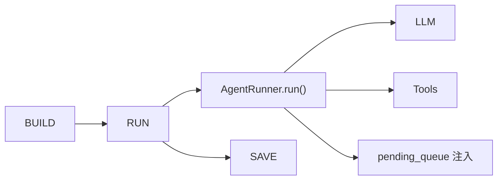

## AgentLoop 职责

**AgentLoop 是“调度中心”，不是“执行引擎”**

- 它负责**接收消息 → 状态管理 → 调用 Runner → 响应输出**的完整流程
- 真正执行 LLM 调用和工具循环的是 `AgentRunner`
- `AgentLoop` 管理的是**会话生命周期**，`AgentRunner` 管理的是**单次推理周期**

**AgentLoop 可以记成一句话：**

* **面向频道/会话的编排器**——从 Bus 收消息、管 session、拼上下文、调 Runner、写回历史、发 outbound。

---

## 内容架构

### 1.类型（Types）

| 类型                | 用途                      | 关键字段                                                                                                      |
| ------------------- | ------------------------- | ------------------------------------------------------------------------------------------------------------- |
| `TurnState`       | 状态机枚举                | `RESTORE`, `COMPACT`, `COMMAND`, `BUILD`, `RUN`, `SAVE`, `RESPOND`, `DONE`                    |
| `TurnContext`     | 一轮对话的上下文背包      | `msg`, `session`, `state`, `history`, `final_content`, `tools_used`, `pending_queue`, `trace` |
| `StateTraceEntry` | 状态执行轨迹（调试/观测） | `state`, `started_at`, `duration_ms`, `event`, `error`                                              |

* **记住**：`TurnContext` 是贯穿整个 `_process_message` 的"行李车"，所有状态处理器都通过它传递数据。

### 2.构造 / 工厂（Construction / Factory）

| 方法            | 职责                                                                                                 |
| --------------- | ---------------------------------------------------------------------------------------------------- |
| `__init__`    | 组装所有零件：tools、sessions、commands、runner、MCP、context builder、consolidator、auto_compact... |
| `from_config` | 从配置文件创建 AgentLoop，封装了 provider 创建、preset 解析等复杂逻辑                                |

* **记住**：`__init__` 很长，本质就是**依赖注入**——把所有零件挂到 `self` 上。

### 3.主循环（Main Loop）

```
run()                    # 常驻任务，消费 inbound 消息
   │
   ├── 优先级命令 → 立即处理
   ├── 斜杠命令 → dispatch_command_inline
   ├── 同会话活跃 → 塞 pending_queue
   └── 新会话 → create_task(_dispatch())
              │
              └── _dispatch()         # 一次派发：加锁 + 建 pending_queue
                    │
                    └── _process_message()   # 状态机驱动一轮对话
```

* **记住**：这是 AgentLoop 的"心脏"——三层嵌套，从收消息到发响应。

### 4.桥接 Runner（Bridge to Runner）

| 方法                  | 职责                                                   |
| --------------------- | ------------------------------------------------------ |
| `_run_agent_loop()` | 真正调用 `self.runner.run(AgentRunSpec(...))` 的地方 |

它做三件事：

1. **绑定上下文**：request context、workspace scope、file state（通过 contextvars）
2. **组装 Hook**：进度回调、流式回调、tool hint 限制
3. **调用 Runner**：把控制权交给 `AgentRunner`，等待执行结果

* **记住**：这是 `loop.py` 和 `runner.py` 的**唯一交接点**。

### 5.状态机处理器（State Handlers）

| 方法               | 状态    | 职责                                       |
| ------------------ | ------- | ------------------------------------------ |
| `_state_restore` | RESTORE | 取 session；恢复 checkpoint；处理附件      |
| `_state_compact` | COMPACT | 检查 TTL 并准备压缩摘要                    |
| `_state_command` | COMMAND | 斜杠命令 → 直接返回；否则继续             |
| `_state_build`   | BUILD   | **读 history + 拼 initial_messages** |
| `_state_run`     | RUN     | **调 `_run_agent_loop` → runner** |
| `_state_save`    | SAVE    | 写会话历史；清 checkpoint                  |
| `_state_respond` | RESPOND | 组装 outbound 消息                         |

* **记住**：这是"固定流水线"——每一轮对话都按这个顺序走一遍。

### 6.会话持久化（Session Persistence）

| 机制                            | 职责                                        |
| ------------------------------- | ------------------------------------------- |
| `_save_turn`                  | 把本轮消息写入 `sessions/*.jsonl`         |
| `_set_runtime_checkpoint`     | 在工具执行过程中保存状态到 session.metadata |
| `_restore_runtime_checkpoint` | `/stop` 后恢复未完成的工具调用            |
| `_mark_pending_user_turn`     | 标记用户消息已写入但 assistant 还没回复     |
| `_restore_pending_user_turn`  | 恢复被中断的"用户消息 → 空响应"状态        |

* **记住**：持久化不只是写历史，还包括**中断恢复**——让用户不会因为 `/stop` 丢失已执行的工具结果。

### 7.旁路入口（Side Entry）

| 方法                            | 使用场景                                     |
| ------------------------------- | -------------------------------------------- |
| `process_direct()`            | CLI 的 `-m` 参数直接发消息，或测试代码调用 |
| `submit_cron_turn()`          | Cron 定时任务触发的消息                      |
| `submit_local_trigger_turn()` | 本地触发器触发的消息                         |
| `_process_system_message()`   | Subagent 等内部系统消息                      |

* **记住**：正常流程是 `run()` → Bus 消费；这些是**绕过 Bus 的直接入口**。

### 总结

| 模块                   | 总结                                                  |
| ---------------------- | ----------------------------------------------------- |
| **类型**         | 状态机 + 上下文背包，贯穿整个处理流程                 |
| **构造**         | 把所有零件（tools/sessions/runner）组装到 `self` 上 |
| **主循环**       | 三层嵌套：收消息 → 派发 → 跑状态机                  |
| **桥接 Runner**  | `loop.py` 和 `runner.py` 的唯一交接点             |
| **状态机处理器** | 7 个步骤的固定流水线，每步做一件事                    |
| **会话持久化**   | 写历史 + 中断恢复（checkpoint）                       |
| **旁路入口**     | CLI、Cron、Subagent 等非 Bus 入口                     |

---

## 主逻辑：三层嵌套

### 层 A — `run()`：常驻调度

```
while running:
    msg = await bus.consume_inbound()
  
    # 1. 优先级命令 → 立即处理（/stop, /model）
    if 是 runtime 控制命令:
        handle_runtime_control()
        continue
  
    # 2. 斜杠命令 → 直接派发
    if commands.is_priority(raw):
        dispatch_command_inline()
        continue
  
    # 3. 同会话已有进行中的 turn → 塞入 pending_queue（mid-turn 注入）
    if effective_key in _pending_queues:
        _pending_queues[key].put_nowait(msg)
        continue
  
    # 4. 否则创建新任务处理
    task = create_task(_dispatch(msg))
    _active_tasks[key].append(task)
```

要点：**跨会话可并发，同会话串行**（靠 `_session_locks` + `_pending_queues`）。

### 层 B — `_dispatch()`：一次派发

```
async with lock, gate:                    # 串行锁 + 并发门控
    pending = Queue(maxsize=20)           # 创建注入队列
    _pending_queues[session_key] = pending
  
    response = await _process_message(msg, pending_queue=pending)
  
    if response:
        await bus.publish_outbound(response)
  
    # 清理：重发队列中剩余消息
    while not pending.empty():
        await bus.publish_inbound(pending.get())
```

### 层 C — `_process_message()`：状态机跑一轮

```
while ctx.state is not DONE:
    handler = getattr(self, f"_state_{ctx.state.name.lower()}")
    event = await handler(ctx)
    ctx.state = _TRANSITIONS[(ctx.state, event)]
```

---

## 状态机

### 七个状态处理器速查

| 状态              | 方法               | 核心职责                                                            |
| ----------------- | ------------------ | ------------------------------------------------------------------- |
| **RESTORE** | `_state_restore` | 取 session；恢复 checkpoint/未完成 user turn；处理附件（图片/文档） |
| **COMPACT** | `_state_compact` | 检查 TTL 并准备压缩摘要                                             |
| **COMMAND** | `_state_command` | 斜杠命令：命中则直接 outbound → DONE；否则继续                     |
| **BUILD**   | `_state_build`   | **核心** ：读 history、拼 `initial_messages`、早写用户消息  |
| **RUN**     | `_state_run`     | **核心** ：调 `_run_agent_loop` → `AgentRunner.run()`    |
| **SAVE**    | `_state_save`    | `_save_turn` 写会话；清 checkpoint；触发后台压缩                  |
| **RESPOND** | `_state_respond` | `_assemble_outbound` 组装回复                                     |

### `RUN` 状态内部细节（和 Runner 的边界）



`_run_agent_loop` 负责：

- 绑定 request / workspace / file state 上下文
- 组装 hook（进度、流式、tool hint）
- 调 `self.runner.run(AgentRunSpec(...))`
- 支持 mid-turn 注入（`injection_callback=_drain_pending`）
- 把结果写回 `TurnContext`

---

## 三个关键设计模式

### 1.Pending Queue（消息注入）

* **目的** ：同会话串行 + mid-turn 注入
* **机制** ：会话处理中，新消息不创建新任务，而是放入队列
* **场景** ：用户追消息、Subagent 结果返回

### 2.Runtime Checkpoint（中断恢复）

* **目的** ：`/stop` 后恢复未完成工具调用
* **机制** ：在工具执行关键阶段保存状态到 session.metadata
* **场景** ：长时间工具执行被中断，不丢失已执行结果

### 3.Subagent 协调

* **目的** ：子代理独立运行但共享上下文
* **机制** ：SubagentManager 管理生命周期，结果通过 pending queue 注入
* **场景** ：复杂任务拆分给子代理并行执行

---

### 排查口诀

| 场景                     | 查哪个文件                                                       |
| ------------------------ | ---------------------------------------------------------------- |
| 消息如何被接收和路由     | `loop.py` → `run()`                                         |
| 会话状态管理、持久化     | `loop.py` → `_state_*`                                      |
| 上下文如何组装（prompt） | `loop.py` → `_state_build` → `context.py`                |
| LLM 如何被调用           | `runner.py` → `AgentRunner.run()`                           |
| 工具循环逻辑             | `runner.py` → `_execute_tool_calls`                         |
| 工具如何定义             | `tools/` 下的各个模块                                          |
| Hook 系统（日志、审计）  | `hook.py` + `_run_agent_loop` 中的 `build_agent_turn_hook` |

---

## 代码精读

### 一 、`TurnState` + `_TRANSITIONS（约 92–236 行）`

这段代码定义了一个**对话代理（Agent）的状态机执行框架**，用于处理LLM（大语言模型）的多轮交互。

#### 1. 状态枚举 (`TurnState`)

定义了代理处理单次用户请求（称为一个"turn"）时的生命周期状态：

- **RESTORE**：恢复会话上下文（从存储加载历史）
- **COMPACT**：压缩/裁剪上下文（当超出窗口限制时）
- **COMMAND**：检查是否有特殊命令（如系统指令）
- **BUILD**：构建发送给LLM的提示词（含历史、记忆、工具）
- **RUN**：调用LLM获取响应
- **SAVE**：保存本次交互到存储
- **RESPOND**：生成并发送最终回复
- **DONE**：处理完成

#### 2. 上下文对象 (`TurnContext`)

携带单次处理所需的所有数据：

- **输入输出**：`msg`（用户消息）、`outbound`（待发送回复）
- **会话信息**：`session_key`、`turn_id`、`session`对象
- **运行时**：`runtime`（指定LLM提供商、模型等）
- **消息历史**：`history`、`all_messages`、`initial_messages`
- **工具相关**：`tools_used`、`tools`（可用工具注册表）
- **流式回调**：`on_progress`、`on_stream`等用于实时推送进度
- **追踪**：`trace`记录每个状态的执行耗时（`StateTraceEntry`）
- **扩展点**：`hooks`和 `hook_factories`用于插入自定义逻辑

#### 3. 代理循环 (`AgentLoop`)

核心执行引擎，主要职责：

##### 属性

- `current_iteration`：当前循环迭代次数
- `tool_names`：可用工具列表
- `provider/model/context_window_tokens`：当前LLM配置
- `model_preset`：模型预设配置（可动态切换）

##### 运行时管理

`llm_runtime()`方法会：

* 从 `runtime_resolver`获取最新的运行时配置
* 若配置发生变化（模型、预设等），通过 `_publish_runtime_selection`发布变更事件
* 支持动态切换模型而无需重启

##### 状态转移表 (`_TRANSITIONS`)

这是**事件驱动的有限状态机**：

- 每个状态处理函数返回一个事件字符串（如"ok"、"dispatch"）
- 根据 `(当前状态, 事件)`查找下一个状态
- 例如：`(RESTORE, "ok") → COMPACT` → `(COMPACT, "ok") → COMMAND` → ...

**执行流程**：

```
RESTORE → COMPACT → COMMAND → BUILD → RUN → SAVE → RESPOND → DONE
```

- COMMAND状态有两种分支：正常继续(`dispatch`)或直接完成(`shortcut`)
- 各状态通过事件驱动解耦，便于测试和扩展

### 4. 设计亮点

1. **可观测性**：`trace`字段记录每个状态的耗时和错误，便于性能分析
2. **灵活性**：通过 `hooks`和 `hook_factories`支持AOP（面向切面编程）
3. **流式支持**：`on_stream`等回调实现实时响应流
4. **错误恢复**：`error`字段在 `StateTraceEntry`中记录异常
5. **运行时动态切换**：`model_preset`可运行时修改，下次处理自动生效
6. **持久化**：`_RUNTIME_CHECKPOINT_KEY`等常量表明支持状态恢复

### 应用场景

这种设计适合构建**复杂的对话AI系统**，比如：

- 需要多步推理（思考→调用工具→再思考）
- 需要上下文管理（压缩长对话）
- 需要流式响应和进度反馈
- 需要动态切换模型（如按用户级别使用不同模型）

这本质上是一个**可控的、可观测的、可扩展的LLM代理执行框架**。

### 二、 `run()` → `_dispatch()` → `_process_message()`（约 917–1417 行）

三、七个 `_state_*`（约 1454–1664 行）——每站干什么

四、 `_run_agent_loop` 里 `self.runner.run(...)` 那一段（约 841–894 行）——交接给 Runner
