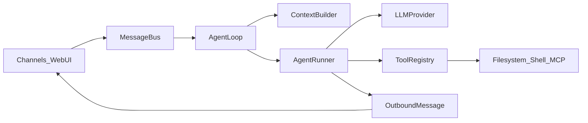

# Agent 机制说明书（P9 教练视角）

> 用本仓库路径解释 agent loop，而不是抽象框架宣传。  
> 作品一句话见 [`BASELINE.md`](./BASELINE.md)。

## 1. 总览

| 环节 | 职责 | 本仓库路径 |
|------|------|------------|
| 入站消息 | 渠道解耦 | [`nanobot/bus/queue.py`](../../nanobot/bus/queue.py) |
| 会话与回合 | session key、hook、上下文装配 | [`nanobot/agent/loop.py`](../../nanobot/agent/loop.py) |
| LLM + 工具循环 | 多轮 tool call 直到结束 | [`nanobot/agent/runner.py`](../../nanobot/agent/runner.py) |
| 工具注册 | 动态 register / 执行 | [`nanobot/agent/tools/registry.py`](../../nanobot/agent/tools/registry.py) |
| 上下文 | system、skills、历史、compaction | [`nanobot/agent/context.py`](../../nanobot/agent/context.py)、[`nanobot/agent/memory.py`](../../nanobot/agent/memory.py) |
| 会话持久化 | history、TTL compaction | [`nanobot/session/manager.py`](../../nanobot/session/manager.py) |
| 权限边界 | workspace / SSRF / sandbox | [`.agent/security.md`](../../.agent/security.md) |
| 教练薄 API | notes/checkin/hub 读写 Markdown | [`nanobot/webui/coach.py`](../../nanobot/webui/coach.py) |
| 教练 Skill | 行为与安全话术 | [`skills/`](./skills/) |

## 2. Agent loop（你要能讲的 6 步）

1. **Channel** 收到用户消息 → 发布 `InboundMessage`。  
2. **AgentLoop** 按 session 取历史，经 **ContextBuilder** 拼 system（含 `AGENTS.md`、Skills）。  
3. **AgentRunner** 调用 LLM；若返回 tool_calls，进入工具执行。  
4. **ToolRegistry** 按名分发；文件系统工具走 workspace 解析器。  
5. 工具结果写回对话，再次调用 LLM（可多轮）。  
6. 最终回复 → `OutboundMessage` → WebUI / 其它渠道。

教练场景下「写 inbox / path.md」不是魔法，而是 **Skill 约束 + write_file/edit_file**。

## 3. 工具注册

- 内置工具在启动时注册进 `ToolRegistry`（filesystem、shell、web、cron、message、long_task 等）。  
- 插件可通过 entry-point / 扫描扩展。  
- 执行入口：`ToolRegistry` 的 execute 路径；错误以 `ToolResult.is_error` 区分。

**面试句**：工具是注册表上的能力面；权限在工具实现里（路径限制、SSRF），不在 prompt  alone。

## 4. 上下文管理

| 层 | 内容 | 真源 |
|----|------|------|
| 人格与约定 | `AGENTS.md`、SOUL/USER | workspace 文件 |
| Skill | `workspace/skills/*/SKILL.md` | 安装自 `learn/P9/skills/` |
| 会话历史 | session store | 可 compaction / Dream |
| 学习进度 | `learning/*/path.md`、`log.md` | **文件真源**（聊天只解释「今天」） |
| 隐藏提示 | `hiddenHistory` | 生成笔记等不污染可见气泡 |

## 5. 权限边界（必须能举例）

| 边界 | 规则 | 教练相关 |
|------|------|----------|
| Workspace | 文件工具默认不出 workspace | inbox/learning/briefs 均在内 |
| SSRF | 出站 HTTP 校验 | 禁止乱打内网/metadata |
| Shell | restrict + 可选 sandbox | **禁止无同意 winget/装包**（Skill + [`SAFEGUARDS.md`](./SAFEGUARDS.md)） |
| Goal | 勿因「用户没回」`complete_goal` | learning-coach Safety |

## 6. 日志 / Trace（失败怎么定位）

| 来源 | 用途 |
|------|------|
| loguru gateway 日志 | 回合错误、工具异常 |
| WebUI transcript `kind: trace` | 工具调用可见轨迹 |
| SDK / provider `usage` | token |
| 可选 Langfuse | 模型调用 trace（见上游 docs） |
| **本作品 eval 报告** | case 级 pass/失败类型/延迟/token：[`eval/results/`](./eval/results/) |

Turn 级建议字段（eval 与 live 对齐）：`case_id`、`tools[]`、`ok`、`failure_type`、`latency_ms`、`prompt_tokens`、`completion_tokens`。

## 7. 体验层 vs Agent 正确性（勿混谈）

迭代 A（[`iteration-a/`](./iteration-a/)）优化的是 **WebUI 性能**：

- Coach GET TTL / in-flight  
- 笔记 htmlToMarkdown 防抖  
- AI notes scope 12k 字符上限  

它们改善网络次数、输入延迟、prompt 体积，**不替代** Skill 安全与文件真源正确性。简历上应分开讲。

## 8. 相关文档

- 产品：[`product-spec.md`](./product-spec.md)  
- 演示：[`SHOWCASE.md`](./SHOWCASE.md)  
- Eval：[`eval/README.md`](./eval/README.md)  
- 复盘：[`retrospective-agent.md`](./retrospective-agent.md)
