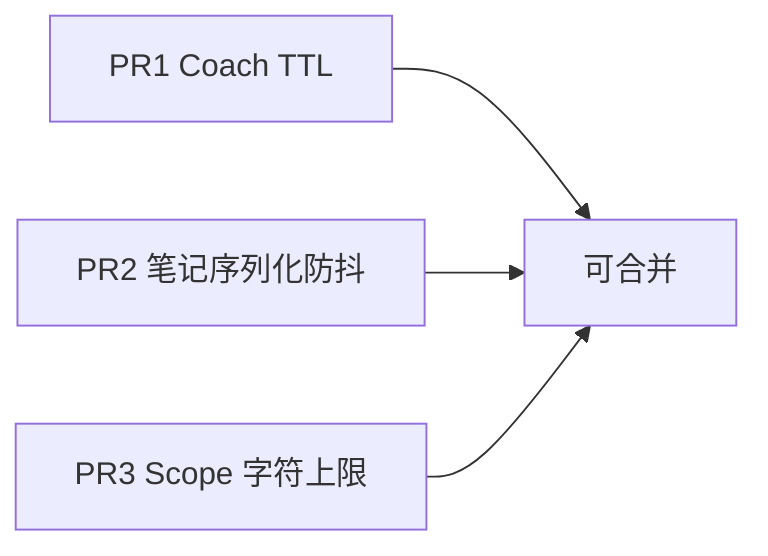

# 迭代 A — 三个独立 PR（性能热点）

> **维护手册（详细行为 / 调参 / 故障）：** [`iteration-a/README.md`](./iteration-a/README.md)  
> 状态：三 PR 已开并向 `base/pre-iteration-a` 合入（2026-07-26）。  
> 背景见 [`retrospective-webui-coach.md`](./retrospective-webui-coach.md) §4.5。

| PR | 链接 | 维护文档 |
|----|------|----------|
| PR1 Coach TTL | [#1](https://github.com/Kirkin0718/nanobot_SecondaryDevelopment/pull/1) | [`iteration-a/01-coach-ttl.md`](./iteration-a/01-coach-ttl.md) |
| PR2 序列化防抖 | [#2](https://github.com/Kirkin0718/nanobot_SecondaryDevelopment/pull/2) | [`iteration-a/02-notes-serialize-debounce.md`](./iteration-a/02-notes-serialize-debounce.md) |
| PR3 Scope 上限 | [#3](https://github.com/Kirkin0718/nanobot_SecondaryDevelopment/pull/3) | [`iteration-a/03-notes-scope-cap.md`](./iteration-a/03-notes-scope-cap.md) |

---

## PR1 — Coach 请求 TTL + in-flight 去重

**标题：** `perf(webui): dedupe coach GET with TTL and turn-end debounce`

**改动文件：**
- `webui/src/hooks/useCoachState.ts`（核心）
- `webui/src/components/thread/ThreadShell.tsx`（`refreshSoon`）
- `webui/src/components/coach/CheckinDrawer.tsx`（打卡后 `force: true`）
- `webui/src/tests/coach-workspace.test.tsx`（`useCoachState` TTL 用例）

**行为：**
- 软刷新：10s TTL 内复用缓存
- 并发 `refresh` 共用一个 in-flight Promise
- `refreshSoon()`：300ms debounce 后 `force` 刷新（回合结束）
- 换会话 / mount：强制拉取

**验收：** Network 中同一会话连开 Notes/Checkin，coach GET 不明显增加。

---

## PR2 — 笔记序列化移出按键路径

**标题：** `perf(webui): debounce rich-notes htmlToMarkdown on input`

**改动文件：**
- `webui/src/components/coach/RichNotesEditor.tsx`

**行为：**
- `onInput` → 900ms debounce 再 `htmlToMarkdown` + `onChange`
- `onBlur` / 工具条 / 粘贴 → 立即 flush

**验收：** ~50KB 笔记连续输入时主线程更顺；blur 后仍能正确落盘。

---

## PR3 — Scope 字符上限

**标题：** `perf(webui): cap AI notes scope to 12k chars`

**改动文件：**
- `webui/src/components/coach/NotesDrawer.tsx`
- `webui/src/i18n/locales/*/common.json`（`scopeTruncated` / `scopeTruncatedNote`）

**行为：**
- 默认勾选按字符预算（上限 12_000）从最近消息往回选
- 生成/补充 prompt 时截断并附加说明
- 范围面板显示截断提示

**验收：** 长会话生成笔记时 prompt 长度有硬顶。

---

## 开 PR / 合入备忘

基线：`base/pre-iteration-a`。三分支互不依赖，可并行 `gh pr merge`。

合入后改行为或常量，请先改 [`iteration-a/`](./iteration-a/) 对应文档，再改代码。
