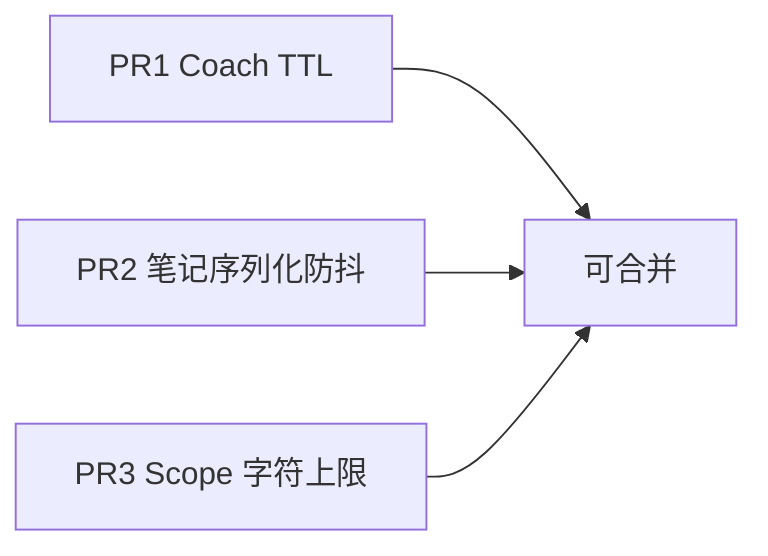

# 迭代 A — 三个独立 PR（性能热点）

> 代码已在本工作区落地。当前目录 **没有 `.git`**，无法直接 `gh pr create`。  
> 恢复 git 远程后，按下列边界各开一个 PR（建议从 `main` 独立分叉，无强依赖）。



---

## PR1 — Coach 请求 TTL + in-flight 去重

**标题建议：** `perf(webui): dedupe coach GET with TTL and turn-end debounce`

**改动文件：**
- `webui/src/hooks/useCoachState.ts`（核心）
- `webui/src/components/thread/ThreadShell.tsx`（`refreshSoon`）
- `webui/src/components/coach/CheckinDrawer.tsx`（打卡后 `force: true`）
- `webui/src/tests/coach-workspace.test.tsx`（`useCoachState` TTL 用例）

**行为：**
- 软刷新：10s TTL 内复用缓存
- 并发 `refresh` 共用一个 in-flight Promise
- `refreshSoon()`：300ms debounce 后 `force` 刷新（回合结束）
- 换会话 / mount：强制拉取

**验收：** Network 中同一会话连开 Notes/Checkin，coach GET 不明显增加。

---

## PR2 — 笔记序列化移出按键路径

**标题建议：** `perf(webui): debounce rich-notes htmlToMarkdown on input`

**改动文件：**
- `webui/src/components/coach/RichNotesEditor.tsx`

**行为：**
- `onInput` → 900ms debounce 再 `htmlToMarkdown` + `onChange`
- `onBlur` / 工具条 / 粘贴 → 立即 flush

**验收：** ~50KB 笔记连续输入时主线程更顺；blur 后仍能正确落盘。

---

## PR3 — Scope 字符上限

**标题建议：** `perf(webui): cap AI notes scope to 12k chars`

**改动文件：**
- `webui/src/components/coach/NotesDrawer.tsx`
- `webui/src/i18n/locales/*/common.json`（`scopeTruncated` / `scopeTruncatedNote`）

**行为：**
- 默认勾选按字符预算（上限 12_000）从最近消息往回选
- 生成/补充 prompt 时截断并附加说明
- 范围面板显示截断提示

**验收：** 长会话生成笔记时 prompt 长度有硬顶。

---

## 开 PR 命令（有 git 后）

```powershell
# 先恢复仓库（示例）
# git clone <remote> ...

git checkout main
git pull

git checkout -b perf/coach-ttl
# 只提交 PR1 文件
git push -u origin HEAD
gh pr create --title "perf(webui): dedupe coach GET with TTL and turn-end debounce" --body "..."

git checkout main
git checkout -b perf/notes-serialize-debounce
# 只提交 PR2 文件
...

git checkout main
git checkout -b perf/notes-scope-cap
# 只提交 PR3 文件
...
```

若本地改动已混在一起，可用 `git add -p` 按文件拆到三个分支。
