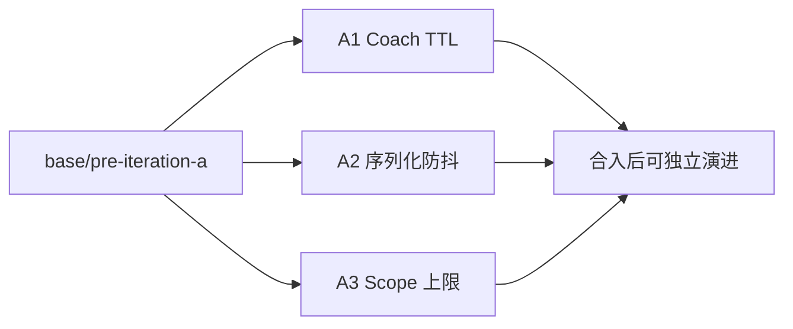

# 迭代 A — WebUI 性能三切片（维护手册）

> 状态：**已完成并合入** `base/pre-iteration-a`（2026-07-26）  
> 背景：[`../retrospective-webui-coach.md`](../retrospective-webui-coach.md) §4  
> 边界速查：[`../iteration-a-three-prs.md`](../iteration-a-three-prs.md)

## 目标

降低动线工作台三类热点，且互不耦合、可独立回滚：

| 阶段 | PR | 主题 | 维护文档 |
|------|-----|------|----------|
| A1 | [#1](https://github.com/Kirkin0718/nanobot_SecondaryDevelopment/pull/1) | Coach GET：TTL + in-flight 去重 + 回合结束 debounce | [`01-coach-ttl.md`](./01-coach-ttl.md) |
| A2 | [#2](https://github.com/Kirkin0718/nanobot_SecondaryDevelopment/pull/2) | 笔记：`htmlToMarkdown` 移出按键路径 | [`02-notes-serialize-debounce.md`](./02-notes-serialize-debounce.md) |
| A3 | [#3](https://github.com/Kirkin0718/nanobot_SecondaryDevelopment/pull/3) | AI 笔记 scope：12k 字符硬顶 | [`03-notes-scope-cap.md`](./03-notes-scope-cap.md) |



## 合并与分支

| 项 | 值 |
|----|-----|
| 集成基线 | `base/pre-iteration-a` |
| 功能分支 | `perf/coach-ttl` · `perf/notes-serialize-debounce` · `perf/notes-scope-cap` |
| 依赖 | **无**；三 PR 可并行合入 |
| 合入后 | 本地 `main` 若仍含「未拆分前的整包改动」，以 `base` + 三 PR 为真相源同步即可 |

## 回归怎么跑

在 `webui/`：

```powershell
npm test -- src/tests/coach-workspace.test.tsx
```

手动冒烟（Chrome DevTools）：

1. **A1**：同会话连开 Notes → Checkin → Hub，Network 中 `coach` GET 不应每次抽屉都打满。
2. **A2**：打开大笔记（约 50KB）连续输入，输入不卡；失焦后内容仍写入 `notes.md`。
3. **A3**：超长会话勾选范围生成笔记，prompt 有硬顶，面板出现截断提示。

## 改常量时先看哪

| 常量 | 文件 | 默认 |
|------|------|------|
| `COACH_TTL_MS` | `webui/src/hooks/useCoachState.ts` | `10_000` |
| `COACH_TURN_END_DEBOUNCE_MS` | 同上 | `300` |
| 序列化 debounce | `webui/src/components/coach/RichNotesEditor.tsx`（`scheduleEmit`） | `900` |
| `NOTES_SCOPE_CHAR_LIMIT` | `webui/src/components/coach/NotesDrawer.tsx` | `12_000` |

改 TTL / scope 上限后，同步更新对应阶段文档中的「调参」表与测试期望。

## 明确不做（本迭代）

- Hub 懒加载 / `_index.json`（迭代 B/C）
- WebSocket `coach_updated` 推送
- 替换 contentEditable 为 TipTap 等重型编辑器
- 服务端 `path.md` mtime 缓存

## 文档维护约定

1. **行为变更**必须更新本目录对应 `0N-*.md` 的「行为契约」与「调参」。
2. **新增调用方**（谁触发 `refresh` / `refreshSoon` / scope）写进该阶段「调用图」。
3. 合入后更新 [`../README.md`](../README.md) 进度表一行即可，勿复制大段实现细节到总 README。
