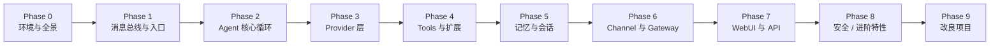

# nanobot 学习路线

> 面向「刚复现项目、Agent 知识较浅」的学习者。目标：吃透 nanobot，能独立扩展与改良。
>
> 配套文档：`[concepts.md](../docs/concepts.md)`（产品概念）→ `[architecture.md](../docs/architecture.md)`（源码地图）→ 本文（学习顺序与验收）。
>
> 学习笔记与检验记录统一放在本目录 `learn/`。  
> **分 Phase 文档**：[`README.md`](./README.md) → `P0/` … `P9/` 各目录下的 `README.md`。

---

## 如何使用本文

1. **按 Phase 顺序推进**，不要跳级读 `agent/loop.py`（除非你已理解消息总线与配置）。
2. **每完成一个 Phase**，在对话中告知导师「Phase N 完成」，会收到 5–8 道检验题。
3. **用测试当地图**：`tests/` 目录结构与 `nanobot/` 一一对应。
4. **动手优先**：每阶段都有「必读文件 + 动手任务 + 验收标准」。

预估总时长：**6–10 周**（每天 1–2 小时）。

---

## 学习原则


| 原则            | 说明                                                                                                   |
| ------------- | ---------------------------------------------------------------------------------------------------- |
| 先跑通，再读源码，再改代码 | 你已跑通 gateway + WebUI，很好                                                                              |
| 沿数据流学习        | 用户消息 → Channel → Bus → AgentLoop → Runner → Provider/Tools → 回写                                      |
| 核心少动，边缘扩展     | 见 `[.agent/design.md](../.agent/design.md)`：能力加在 channel / tool / skill，而非堆在 `loop.py` / `runner.py` |
| 用测试验证理解       | `pytest tests/<模块>/ -v`                                                                              |


---


## 路线图总览




---


## Phase 0：环境与全景（2–3 天）

**详细任务与进度**：[`P0/README.md`](./P0/README.md)

**目标**：知道 nanobot 是什么、怎么跑、模块边界在哪。

### 必读（按顺序）


| 顺序  | 文件                                                | 目的             |
| --- | ------------------------------------------------- | -------------- |
| 1   | `[docs/concepts.md](../docs/concepts.md)`         | 产品级概念，不读源码也能懂  |
| 2   | `[docs/architecture.md](../docs/architecture.md)` | 源码地图与核心流程图     |
| 3   | `[AGENTS.md](../AGENTS.md)`                       | 子系统一览          |
| 4   | `[.agent/design.md](../.agent/design.md)`         | 架构约束（核心 vs 边缘） |
| 5   | `[.agent/gotchas.md](../.agent/gotchas.md)`       | 常见坑            |


### 动手任务

1. 确认 `~/.nanobot/config.json` 与 `~/.nanobot/workspace/` 各存什么（见 `concepts.md`）。
2. 在 WebUI 发一条消息，同时在 gateway 终端观察日志。
3. 在对话里输入 `/help`、`/status`、`/model`，看返回内容。
4. 自己画一张「消息从进入到回复」的简图（5–7 个方框即可）。


### 验收标准

- [ ] 能口述核心数据流（Channel → Bus → AgentLoop → Runner → Provider/Tools → 回写）。
- [ ] 能区分 `config.json`（配置）与 `workspace/`（运行时状态）。
- [ ] 知道 agent 有哪些 tool、从哪里查看（见下文「如何查看 agent 拥有的 Tool」）。


### Phase 0 入门检验（参考答案）

**Q1. 核心数据流**

```
用户消息
  → Channel（如 WebUI / WebSocket）
  → MessageBus（inbound 队列）
  → AgentLoop（选 session、建上下文、协调 turn）
  → AgentRunner（调 LLM、执行 tool、多轮循环）
  → Provider（发请求给模型）/ Tools（读写文件、shell 等）
  → AgentLoop 写 session、发 outbound
  → MessageBus（outbound 队列）
  → Channel 把回复展示给用户
```

**Q2. AgentLoop vs AgentRunner**（你已部分掌握，补全版）


| 组件            | 职责                                                          | 调试时先看                  |
| ------------- | ----------------------------------------------------------- | ---------------------- |
| `AgentLoop`   | 面向**频道/会话**：收消息、session key、workspace、拼上下文、hooks、发 outbound | 路由、session、工作区、回复没回到频道 |
| `AgentRunner` | 面向**模型**：调 provider、处理 streaming、执行 tool calls、迭代直到出最终答案    | 模型报错、tool 没执行、迭代超限     |


分成两个文件的原因：Channel 侧编排与 Model 侧对话循环是不同关注点；设计文档要求核心路径保持小而清晰。

**Q3. 核心 vs 边缘；「查天气」加在哪**

- **核心（少改）**：`agent/loop.py`、`agent/runner.py`、`bus/`
- **边缘（优先扩展）**：`channels/`、`agent/tools/`、`skills/`、MCP 服务器、prompt 模板

「查天气」应做成 **Tool**（如 `weather.py` 调天气 API），必要时配一个 **Skill**（教 agent 何时用、参数怎么填）。不要写进 `loop.py`。

**Q4. list_dir 从哪来**

列出目录时，模型通常会调用 filesystem 相关 tool。工具名 `list_dir` 定义在 `nanobot/agent/tools/filesystem.py`。终端里看到的 `[tool] list_dir` 是 runner 执行 tool 时的日志。

**Q5. templates 与 Python 的关系**

`nanobot/templates/*.md` 是 Jinja2 模板，由 `nanobot/utils/prompt_templates.py` 加载，注入系统 prompt（身份、平台策略、心跳任务说明等）。**改模板 = 改 agent 行为**，效果和改 Python 里拼 prompt 的代码类似，但更适合调「人设」和「策略」。

---


## 如何查看 agent 拥有的 Tool


| 方式          | 说明                                                                                                  |
| ----------- | --------------------------------------------------------------------------------------------------- |
| **读源码目录**   | `nanobot/agent/tools/` 下每个模块一个或多个 Tool；`loader.py` 自动扫描注册                                           |
| **读配置**     | `~/.nanobot/config.json` 里 `tools.`* 可启用/禁用部分能力（如 web、shell、mcp）                                    |
| **对话中观察**   | WebUI / gateway 终端在 tool 执行时会打印类似 `[tool] list_dir`                                                 |
| **问 agent** | 可问「你有哪些工具？」；若启用了 `my` tool，可 `my(action="check")` 查运行时状态（见 `[docs/my-tool.md](../docs/my-tool.md)`） |
| **读文档**     | `[docs/architecture.md#tools](../docs/architecture.md)` 列出主要 tool 文件                                |
| **读测试**     | `tests/tools/test_tool_registry.py` 可见注册了哪些内置 tool                                                  |


常用内置 tool 举例：`read_file`、`write_file`、`edit_file`、`list_dir`、`exec`（shell）、`web_search`、`web_fetch`、`mcp_*`、`cron`、`image_generation`、`my`（自检）等。具体以你 config 里启用的为准。

---


## Phase 1：消息总线与入口（3–4 天）

**详细任务**：[`P1/README.md`](./P1/README.md)

**目标**：理解解耦架构的骨架。

### 必读

- `nanobot/bus/queue.py` — 双队列 MessageBus
- `nanobot/bus/events.py` — InboundMessage / OutboundMessage
- `nanobot/cli/commands.py` — CLI 入口
- `nanobot/gateway/service.py` — Gateway 如何组装各子系统


### 动手

1. 在 `MessageBus.publish_inbound` / `publish_outbound` 旁加临时日志，观察一条 WebUI 消息的时序。
2. 读 `tests/` 中与 bus / gateway 相关的 smoke 测试。


### 验收标准

- [ ] 能解释为什么 Channel 和 Agent 之间用 Bus 而不是直接调用。
- [ ] 能说出 `nanobot gateway` 启动时大致初始化了哪些组件。

---


## Phase 2：Agent 核心循环（1–1.5 周）⭐ 最重要

**详细任务**：[`P2/README.md`](./P2/README.md)

**目标**：吃透 Agent 的「大脑」。

### 必读（按顺序）

1. `nanobot/agent/loop.py` — turn 生命周期、session、上下文
2. `nanobot/agent/runner.py` — LLM 多轮 + tool 执行循环
3. `nanobot/agent/context.py` — 系统 prompt、skills 注入
4. `nanobot/agent/hook.py` — 生命周期钩子
5. `nanobot/utils/prompt_templates.py` + `nanobot/templates/`


### 关键概念

- `AgentRunSpec` — 一次执行的配置
- `max_iterations` — 防止无限 tool loop
- streaming / checkpoint / retry
- `_MAX_INJECTIONS_PER_TURN` — 上下文注入上限


### 动手

1. 跟读 `tests/agent/test_runner_core.py` 里一次 `list_dir` 的完整路径。
2. 改 `templates/identity.md` 一句话，观察 agent 语气变化。
3. `pytest tests/agent/test_runner_core.py -v`


### 验收标准

- [ ] 能手绘 Runner 的 while 循环：LLM → tool calls → 结果回传 → 再调 LLM。
- [ ] 能判断一个问题该查 `loop.py` 还是 `runner.py`（见 `architecture.md`）。

---


## Phase 3：Provider 层（4–5 天）

**详细任务**：[`P3/README.md`](./P3/README.md)

**目标**：理解 LLM 抽象与多厂商适配。

### 必读

- `nanobot/providers/base.py`
- `nanobot/providers/factory.py`
- `nanobot/providers/openai_compat_provider.py`
- `nanobot/providers/anthropic_provider.py`（对比差异）


### 动手

1. 在 config 里看清当前 `provider` / `model` / `apiKey` 如何对应到具体类。
2. 读 `tests/providers/test_provider_retry.py` 理解重试。


### 验收标准

- [ ] 能说明 `LLMProvider` 子类必须实现哪些能力。
- [ ] 能解释 streaming 如何传到 Channel/WebUI。

---


## Phase 4：Tools 与扩展机制（1 周）

**详细任务**：[`P4/README.md`](./P4/README.md)

**目标**：理解 Agent 的「手」。

### 必读

- `nanobot/agent/tools/base.py`
- `nanobot/agent/tools/registry.py`
- `nanobot/agent/tools/loader.py`
- 选读：`filesystem.py`、`shell.py`、`mcp.py`
- `nanobot/skills/` — skill 作为知识型扩展
- `[docs/my-tool.md](../docs/my-tool.md)`


### 动手（本阶段里程碑）

**实现一个最小自定义 Tool**（例如返回当前时间的 `get_current_time`），注册并让 agent 能调用。可参考 `docs/` 与 `tests/tools/`。

### 验收标准

- [ ] 能独立实现并注册新 Tool。
- [ ] 能区分 Tool（可执行能力）与 Skill（使用说明/知识）。

---


## Phase 5：记忆与会话（4–5 天）

**详细任务**：[`P5/README.md`](./P5/README.md)

**目标**：持久化与上下文管理。

### 必读

- `nanobot/agent/memory.py` — Dream 两阶段 consolidation
- `nanobot/session/manager.py` — SessionManager、auto-compaction
- `nanobot/session/goal_state.py` — 长期目标
- `[docs/memory.md](../docs/memory.md)`


### 动手

1. 打开 `workspace/` 下 session 相关文件，对照代码看 JSONL 格式。
2. 长对话后观察 compaction 是否触发。


### 验收标准

- [ ] 能解释 atomic write（temp + fsync + rename）的意义。
- [ ] 能说明 compaction 大致何时触发。

---


## Phase 6：Channel 与 Gateway（4–5 天）

**详细任务**：[`P6/README.md`](./P6/README.md)

**目标**：多平台接入。

### 必读

- `nanobot/channels/base.py`
- `nanobot/channels/websocket.py`
- `nanobot/channels/manager.py`
- `nanobot/pairing/store.py`


### 动手

只启用 websocket channel，trace 一条 WebUI 消息从进入到展示的全路径。

### 验收标准

- [ ] 能说明新增 Channel 要实现哪些接口、如何被发现注册。

---


## Phase 7：WebUI 与 API（3–4 天）

**详细任务**：[`P7/README.md`](./P7/README.md)

**目标**：前端与 OpenAI 兼容 API。

### 必读

- `nanobot/api/server.py`
- `webui/vite.config.ts`
- `nanobot/session/webui_turns.py`
- `[docs/openai-api.md](../docs/openai-api.md)`、`[docs/webui.md](../docs/webui.md)`


### 动手

用 curl 调一次 `/v1/chat/completions`。

### 验收标准

- [ ] 能解释 WebUI 如何通过 WebSocket 与 gateway 通信。

---


## Phase 8：安全与进阶特性（3–4 天）

**详细任务**：[`P8/README.md`](./P8/README.md)

**目标**：生产级考量。

### 必读

- `nanobot/security/workspace_access.py`
- `nanobot/agent/tools/sandbox/`
- `nanobot/agent/subagent.py`
- `nanobot/cron/service.py`
- `nanobot/command/router.py`


### 验收标准

- [ ] 能说明 workspace 如何限制 agent 文件访问。
- [ ] 能简述 subagent 与主 agent 的关系。

---


## Phase 9：改良项目（持续）

**详细任务**：[`P9/README.md`](./P9/README.md)  
**已选选题**：个人办公/学习教练（楔子 A+B）— [`P9/QUICKSTART.md`](./P9/QUICKSTART.md)

在 Phase 0–8 检验通过后，与导师一起选型、拆 PR、写测试。

### 当前选题：办公/学习教练

| 文档 | 说明 |
|------|------|
| [`P9/product-spec.md`](./P9/product-spec.md) | 产品说明 |
| [`P9/install.ps1`](./P9/install.ps1) | 安装 Skill + HEARTBEAT 到 workspace |
| [`P9/implementation-roadmap.md`](./P9/implementation-roadmap.md) | PR-1～PR-3 |

### 其他改良方向（按难度）


| 难度  | 方向                      | 练到的能力    |
| --- | ----------------------- | -------- |
| ⭐   | 新增自定义 Tool + Skill      | 扩展机制     |
| ⭐   | 新增简化 Channel            | 平台接入     |
| ⭐⭐  | 改进 memory compaction 策略 | 上下文工程    |
| ⭐⭐  | Runner 可观测性（trace/span） | 可观测性     |
| ⭐⭐  | RAG Tool（本地向量检索）        | 检索增强     |
| ⭐⭐⭐ | Multi-agent 协作编排        | 高级架构     |
| ⭐⭐⭐ | 评估框架（benchmark）         | Agent 评测 |


---


## 与导师的协作节奏


| 你完成             | 导师提供                |
| --------------- | ------------------- |
| Phase N 动手 + 自测 | Phase N 检验题（5–8 道）  |
| 提交答案            | 逐题点评 + 盲区补充阅读       |
| Phase 0–8 通过    | 选定 Phase 9 改良项，结对实现 |


回复格式示例：**「Phase 0 完成」** 或 **「Phase 0 检验题答案：…」**。

---


## 当前进度记录（2026-07-14 更新）


| 项目 | 状态 |
|------|------|
| Phase 0 学习内容 | ✅ 概念 / config / workspace / 流程图 |
| Phase 0 正式检验 | ⏳ [`P0/检验题.md`](./P0/检验题.md) |
| Phase 1+ | 未开始 |

**建议下一步**：作答 Phase 0 检验题 → 回复 **「Phase 0 检验题答案」**。通过后进入 [`P1/README.md`](./P1/README.md)。

---


## 附录：推荐命令

```bash
# 启动 gateway
nanobot gateway

# WebUI 开发（另开终端）
cd webui && bun run dev

# 单测（示例）
pytest tests/agent/test_runner_core.py -v
pytest tests/tools/test_tool_registry.py -v

#  Lint
ruff check nanobot/
```

